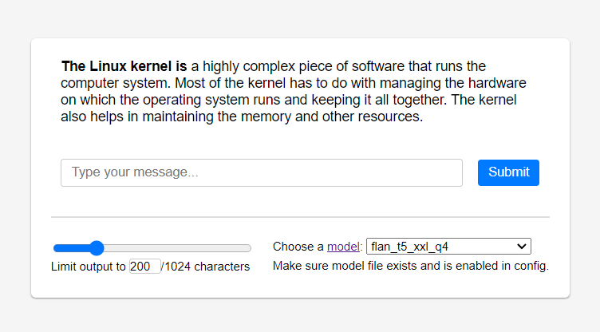

# Chat Box



This is Chat Box, a simple project with Fabrice Bellard's [ts_server](https://bellard.org/ts_server/) REST API backend and a [frontend](chatbox.html) which was mostly generated by ChatGPT (GPT-4).

Additionally, a JS implementation of iteration over chunked transfer encoding was requested from and successfully implemented using ChatGPT as well.

Only certain aspects of the initial implementation have been polished manually such as tweaking the font-size, paddings/margins and other minor cosmetic touchups as well as adding convenience features such as storing the selected model file in a session cookie, etc. Overall, the project took one evening from a concept to an actual tested implementation.

# Running the application
## Prerequisites
- Docker Compose
- [Model file(s)](https://bellard.org/ts_server/#:~:text=1.7-,Available%20Models,-We%20provide%20here).

Copy [ts_server.cfg.example file](configs/ts_server.cfg.example) to `configs/ts_server.cfg`.

Download at least one model, put the model file into the `models` directory and update the `models` list in the `configs/ts_server.cfg` file accordinglly. I suggest to start with `flan_t5_xxl_q4.bin` and/or `gptj_6B_q4.bin` which are offering a good size/performance ratio. However, LLaMA models are even better in this regard if you have access to those.

Note: Restart the container (`docker compose restart ts_server`) when you add new models. Don't forget to select the new model in the dropdown on the Chat Box page. It already contains a predefined list of all the models listed on ts_server website.

## Building/starting the app
The following will build/download necessary containers and bring the application up:
> `docker compose up`

Alternatively, you can run it detached and watch the logs so that Ctrl+C doesn't terminate containers.
> `docker compose up -d && docker compose logs -f`

Two UIs will now be available for you:
* Chat Box UI: http://localhost:9000
* ts_server built-in HTML GUI: http://localhost:8080

It might take several minutes to load big models until the API becomes available.

# Initial prompt
Here's the initial prompt to ChatGPT which served as a foundation and a kickstart for this project:
> Generate a self-contained HTML page with CSS and JS which displays a chat box with a submit button and a slider which controls the maximum amount of tokens. When a submit button is pressed, an XHR request should be sent to http://localhost:8080/v1/engines/flan_t5_xxl_q4/completions with Content-Type header set to application/json. The JSON body of that request looks like this: {"prompt": "Text from chat input", "max_tokens": 200} where "Text from chat input" should be actual text coming from the chat input on the page and "max_tokens" integer value should come from the slider (200 in this example). The slider should max out at 2000.
>
> A successful response will contain a body like this:
> ```
> {"text":"This is a text from response","reached_end":true}
> ```
>
> and the value of the "text" field, which in this specific example is "This is a text from response" but could be different in other response and should be treated as variable, should be appended to the page to look like a conversation. "reached_end" field in the response can be ignored.
>
> If the status code of the response is not 200, an error should be shown to the user.

# References and credits
- [ChatGPT](https://chat.openai.com/chat)
- [ts_server documentation](https://bellard.org/ts_server/ts_server.html)
- [TextSynth API description](https://textsynth.com/documentation.html)
- [Docker-compose nginx CORS proxy](https://gist.github.com/iki/1247cd182acd1aa3ee4876acb7263def)
